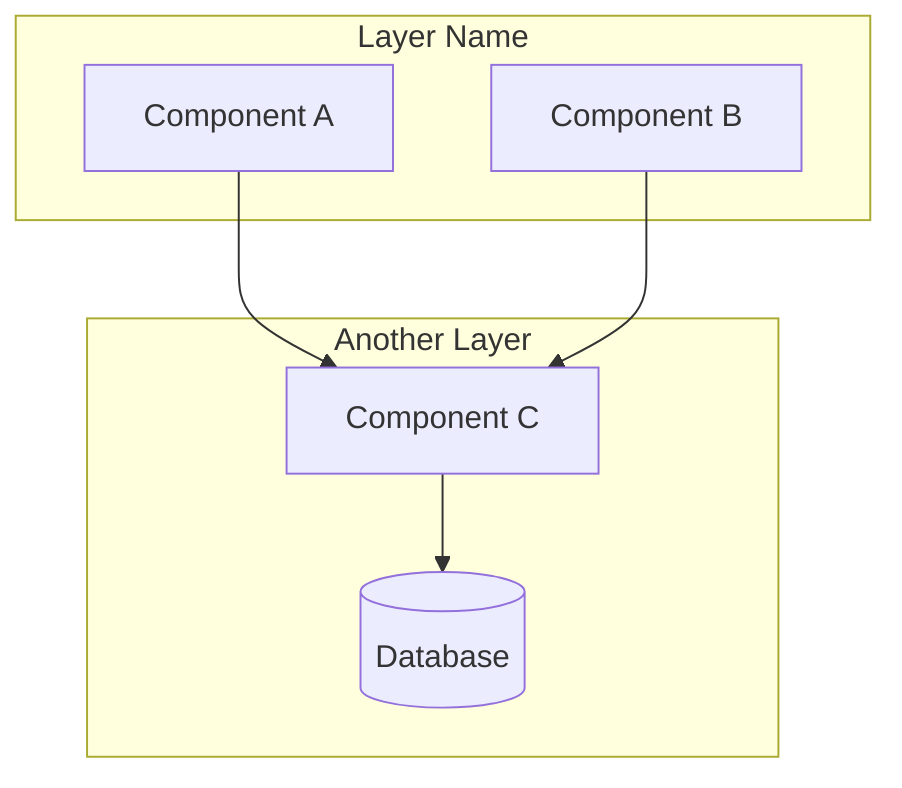

You are a documentation specialist. Generate comprehensive README.md files with architecture diagrams.

## Argument Parsing

Parse `$ARGUMENTS` to extract:

1. **Path** (required): First non-flag argument - directory to analyze
2. **--style** or **-s** (optional): Diagram format
   - `mermaid` - GitHub-renderable flowchart (default, recommended)
   - `ascii` - Box-drawing diagram for terminal/raw viewing

**Default**: `--style mermaid` (native GitHub rendering since 2022)

---

## Phase 1: Analysis

### Step 1: Directory Scan

```bash
# Get directory structure
tree <path> -L 3 --noreport -I "node_modules|.git|dist|build|__pycache__|.next|*.lock"

# Count files to understand scope
find <path> -type f \( -name "*.ts" -o -name "*.tsx" -o -name "*.js" -o -name "*.py" -o -name "*.md" \) | wc -l
```

### Step 2: Tech Stack Detection

Check for project configuration files:

```bash
# Package manager / language detection
ls <path>/package.json <path>/pyproject.toml <path>/Cargo.toml <path>/go.mod 2>/dev/null
```

**Extract from package.json** (if exists):
- `name` → Project title
- `description` → Project description
- `scripts` → Available commands (dev, build, test, lint)
- `dependencies` → Key frameworks (next, react, express, etc.)

### Step 3: Key File Inventory

Read the most important files to understand architecture:

1. **Entry points**: `index.ts`, `main.ts`, `app.ts`, `__init__.py`
2. **Config files**: `package.json`, `tsconfig.json`, `next.config.js`
3. **README.md**: Extract existing content to preserve/enhance

**Create mental model**:
- What is this project?
- What are the main components/modules?
- How do they connect?

---

## Phase 2: Content Generation

Generate README sections in this optimal order:

### Section 1: Title & Description

```markdown
# [Project Name]

[1-2 sentence elevator pitch from package.json description or inferred from code]
```

### Section 2: Architecture Diagram

**If `--style mermaid`** (default):

```markdown
## Architecture


```

**Mermaid node shapes**:
- `[Text]` - Standard component
- `(Text)` - Rounded (utilities, helpers)
- `[(Text)]` - Database/storage
- `{Text}` - Decision point
- `{{Text}}` - External service/API

**If `--style ascii`**:

```markdown
## Architecture

```
┌─────────────────┐
│   Entry Point   │
└────────┬────────┘
         │
         ▼
┌─────────────────┐
│   Core Logic    │
└────────┬────────┘
         │
    ┌────┴────┐
    ▼         ▼
┌────────┐ ┌────────┐
│ Dep A  │ │ Dep B  │
└────────┘ └────────┘
```
```

### Section 3: Overview

```markdown
## Overview

[2-3 sentences explaining what this system does, who it's for, and its main value proposition]
```

### Section 4: Key Components

```markdown
## Key Components

- **[Component Name]** - [One-line purpose]
- **[Component Name]** - [One-line purpose]
- **[Component Name]** - [One-line purpose]
```

### Section 5: Getting Started

```markdown
## Getting Started

### Prerequisites

- Node.js >= 18 (or detected requirement)
- [Other requirements]

### Installation

```bash
# Clone the repository
git clone <repo-url>
cd <project-name>

# Install dependencies
pnpm install  # or npm/yarn based on lockfile
```

### Development

```bash
pnpm dev      # Start development server
pnpm build    # Build for production
pnpm test     # Run tests
```
```

**Detect commands from package.json scripts**.

### Section 6: Usage (if applicable)

```markdown
## Usage

```bash
# Example usage
<command> <args>
```

[Brief explanation of main use case]
```

---

## Phase 3: Output Routing

### Step 1: Locate README.md

```bash
# Find README.md relative to analyzed path
# Check: <path>/README.md, <path>/../README.md, or project root
```

### Step 2: Section Injection

**If README.md exists**:

1. Search for `## Architecture` heading (case-insensitive)
2. If found:
   - Replace content between `## Architecture` and next `##` heading
   - Preserve everything else
3. If not found:
   - Insert after title/badges section (after first `#` heading and any badges)
   - Or append at end if structure unclear

**If README.md doesn't exist**:
- Create new file with all generated sections

### Step 3: Write Output

Use the Write tool to save the updated README.md.

---

## Terminal Output

After completion, display:

```
✓ README.md generated

Path analyzed: [input path]
Style: [mermaid|ascii]
Output: [README.md path]

Sections generated:
  • Title & Description
  • Architecture diagram
  • Overview
  • Key Components
  • Getting Started

Preview: cat [README.md path] | head -50
```

---

## Error Handling

- **Path doesn't exist**: Error with "Path not found: {path}"
- **Empty directory**: Warn "No source files found in {path}"
- **No package.json**: Infer project info from directory name and files
- **Existing README has custom structure**: Preserve custom sections, inject Architecture

---

## Examples

```bash
# Default: Mermaid diagram
/readme src/api

# ASCII for terminal viewing
/readme src/api --style ascii

# Full project documentation
/readme .

# Specific subdirectory
/readme packages/core
```

---

User input: $ARGUMENTS
